

rpi-sdr-replay
==============

**Turns Raspberry Pi into a remotely controlled software Defined Radio (SDR)
transceiver that captures and replays radio signals.**

Use your Android smartphone to control when the radio signal recording should start,
when it should end and then replay it on your discretion. 

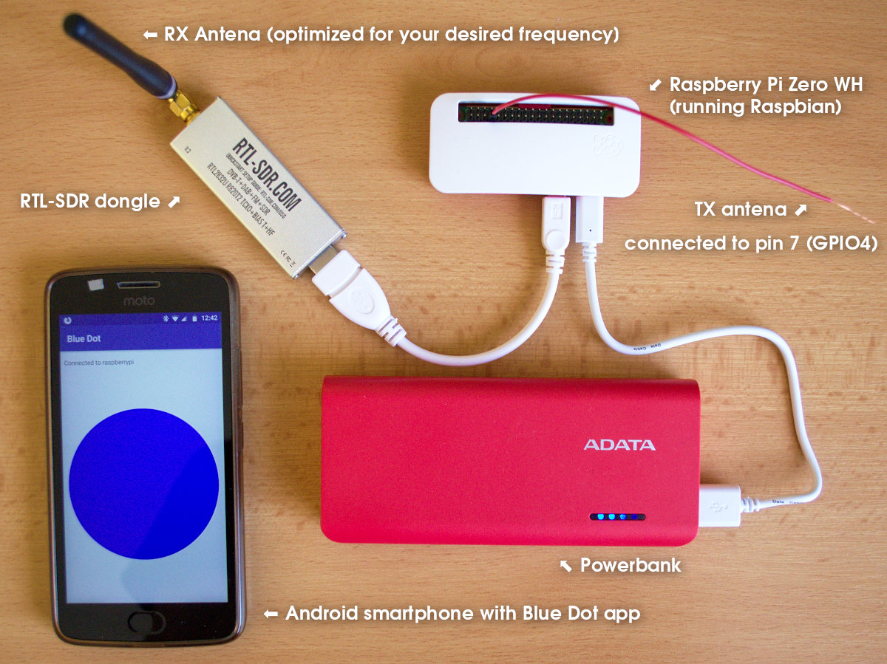

Usage
=====

**rpi-sdr-replay** is composed from two parts:

**1) Server part** is this rpi-sdr-replay python library and application. It can record and replay radio
signals on configurable radio frequencies (with this tool, you can record signal on
one radio frequency and replay it on another radio frequency). The recording and
replaying is triggered manually by user on his discretion via a Bluetooth app.

**2) Client part (Android smartphone app)** is a generic [Blue Dot](https://bluedot.readthedocs.io/en/latest/)
application that is available in [Google Play Store](https://play.google.com/store/apps/details?id=com.stuffaboutcode.bluedot).
It doesn't require any special configuration in order to be used with rpi-sdr-replay
server part. Only requirement is that the smartphone running the Blue Dot and the
Raspberry Pi running the rpi-sdr-replay are paired (how to do that is described later in this readme).
 
**Main features**

* Record a radio transmission and replay it whenever you want (seconds, minutes, days, months later).
* Record a radio transmission on one frequency and replay it on another frequency.
* Control the recording and replaying remotely via Bluetooth.
* No need of Wi-Fi connection with the Raspberry Pi when using and controlling the recording/replaying.
  * The recording and replaying is controlled just via Bluetooth, you don't need any kind of ssh or
     a similar connection to your Raspberry Pi system for this to work.
* No need of a display or any extra user interface hardware for the Raspberry Pi.
* If you use a power bank to power your Raspberry Pi device, you can walk around the world and
  record/replay radio signals freely.
  
**Disclaimer:** Different radio frequencies have different terms for usage. Always consult
your local laws and legal obligations for usage of specific frequencies.
Some frequencies are licensed and cannot be used.
Be considerate and do not cause noise on any frequencies.
For transmitting, you are supposed to use an antenna with a proper band-pass filter!

Command line (The server part)
-----------------------------

**Record and replay signals on 88,3 MHz (FM frequency)**

    $ rpi-sdr-replay -f 88300000

Note: Recordings are stored to a default location ``$HOME/sdr-recordings``

**Record on 88,3 MHz and replay on 88,5 MHz**

    $ /home/pi/git/rpi-sdr-replay/rpi-sdr-replay \
        --rx-frequency 88300000 \
        --tx-frequency 88500000 \
        -d /home/pi/sdr-recordings-fm/

Note: Recordings are stored to a custom directory ``/home/pi/sdr-recordings-fm/`` (the directory must exist!).

**See help for details (--help/-h)**

    $ rpi-sdr-replay --help
    usage: rpi-sdr-replay [-h] [-f FREQUENCY] [-r RX_FREQUENCY] [-t TX_FREQUENCY]
                          [-p] [-d DIR]
    
    Raspberry Pi based bluetooth controlled radio signal replayer
    
    optional arguments:
      -h, --help            show this help message and exit
      -f FREQUENCY, --frequency FREQUENCY
                            Set frequency in Hz for both RX & TX (Default:
                            433050000)
      -r RX_FREQUENCY, --rx-frequency RX_FREQUENCY
                            Set RX frequency in Hz
      -t TX_FREQUENCY, --tx-frequency TX_FREQUENCY
                            Set TX frequency in Hz
      -p, --allow-pairing   Allow bluetooth pairing for the first 60sec after
                            start
      -d DIR, --dir DIR     Directory where to store the recordings

Graphical SmartPhone BlueDot app interface (The client part)
------------------------------------------------------------

The Blue Dot application that is used as a smartphone UI only allow us to have a
UI with one dot (or square) and control its color and that's it.

That said, the user interface for rpi-sdr-replay (that uses the Blue Dot) is
based on differently colored dots that define state of the application.
The dot color tells you in what state the app is and defines what actions could
be done.

The dot itself is clickable and rpi-sdr-replay application recognizes several
"zones" that works like "buttons".
Here is a schema of the zones:

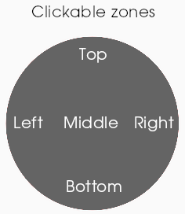

Actions triggered by the individual zones depends on the state of the application
which is described by the color of the dot.
See the next section that describes the individual states (dot colors) and their
clickable zones. Not all application states use all zones.
 

### Blue Dot app connect menu

Select your Raspberry Pi device from the list (it must be paired):

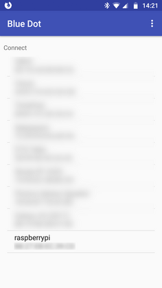

### (Blue dot) Main screen

* **Middle** to start recording (Red dot)
* **Left** to go to the latest available recording (Bright green dot)
* **Bottom** to open "turn off" screen (Black dot)

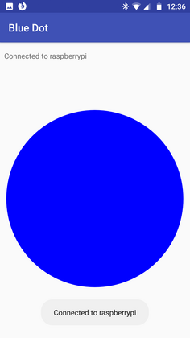

### (Red dot) Recording in progress

* **Press anywhere on the dot** to stop the recording (Bright green dot)

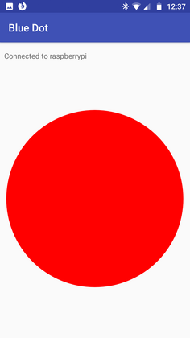

### (Bright green dot) Latest recording

* **Middle** to replay the recording (No dot shown)
* **Left** to go to older recording (Dark green dot)
* **Right** to go back to the main screen (Blue dot)
* The latest (newest) recording always has this bright green color.

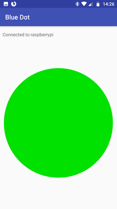

### (Dark green dot) Latest-1 recording

* **Middle** to replay the recording (No dot shown)
* **Left** to go to older recording (Greyish dark green dot)
* **Right** to go to newer recording (Bright green dot)
* Note: Except of the latest recording that is bright green all other
recordings are dark green and then the older the recording is, its color
get's more lighter ("greyish"). 

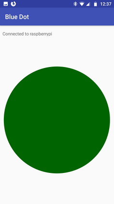

### (Greyish dark green dot) Latest-2 recording

* **Middle** to replay the recording (No dot shown)
* **Left** to go to older recording (Even more greyish-dark-green dot)
* **Right** to go to newer recording (Dark green dot)
* Note: Except of the latest recording that is bright green all other
recordings are dark green and then the older the recording is, its color
get's more lighter ("greyish").

And so on for all other Latest-N recordings..

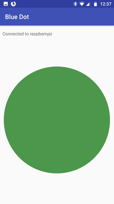

### (White dot with border) No more old recordings available

* **Right** to go to newer recording

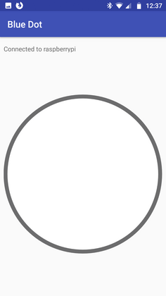

### (No dot shown) Recording is being replayed

* No dot is displayed
* You need to wait till full recording is replayed

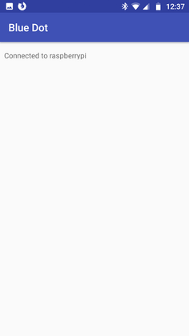

### (Black dot) Turn off screen

* **Middle** to confirm the operating system shutdown (Turns off the whole Raspberry Pi!)
* **Left/Right/Bottom/Top** cancel the shutdown and go back to the main screen (Blue dot)

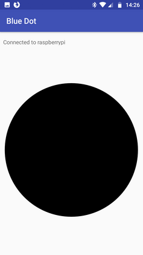

Hardware requirements
=====================

* Raspberry Pi with Bluetooth ([that supports rpitx](https://github.com/F5OEO/rpitx#hardware))
  * I use **RaspberryPi Zero WH**
* RTL-SDR dongle
  * There are multiple ones
  * I use [RTL-SDR V3](https://www.rtl-sdr.com)
* RX & TX Antennas
  * Antennas that fits your needs
* (Optional) Power bank

Setup
=====

**Note:** The setup described in this readme is written for **Raspbian**. Different Linux
distribution may have differently named packages and may require different approach to configuration.

Raspbian system packages
------------------------

    $ sudo apt install \
        build-essential \
        python3-dbus \
        python3-pip \
        git \
        rtl-sdr

Python libraries
----------------

*Note: Before you install python modules by pip, you should consider
use of a python virtual environments (especially for development).
See later section of this readme.*

    $ pip3 install -r requirements.txt

RTL-SDR setup
-------------

Raspbian system packages got installed in one of previous steps when
**rtl-sdr** package was installed.

Now you need to **blacklist default kernel modules with drivers for RTL-SDR**
chipset that are used for DVB-T decoding.

Depending on the chipset your dongle has, you need to blacklist the correct
kernel module. If you are not sure, you can uncomment all names and blacklist
all of them:

    $ sudo vim /etc/modprobe.d/blacklist-rtl-sdr-dvbt-modules.conf

And add:

    blacklist dvb_usb_rtl28xxu
    blacklist 8192cu
    blacklist rtl8xxxu
    #blacklist rtl2832
    #blacklist rtl2830

Note: Make sure you removed the hash symbol ``#`` from the beggining of the
line that lists the name of kernel module for chipset of your RTL-SDR dongle.
In this example I only blacklist a sub-set of them.

Once done, try to plug in the dongle and run this command to test it:

    $ rtl_test

rpitx setup
-----------

rpitx is a general radio frequency transmitter for Raspberry Pi which doesn't
require any other hardware unless filter to avoid intererence. It can handle
frequencies from 5 KHz up to 1500 MHz.

Project repository: https://github.com/F5OEO/rpitx

Installation instructions:

    $ git clone https://github.com/F5OEO/rpitx
    $ cd rpitx
    $ ./install.sh
    $ sudo reboot

Bluetooth permissions
---------------------

rpi-sdr-replay requires permissions to be able to control Bluetooth interface.
This section shows you how to configure the permissions:

    $ sudo vim /etc/dbus-1/system.d/bluetooth.conf

Add this section (assuming your user is "pi"):

      <policy user="pi">
        <allow own="org.bluez"/>
        <allow send_destination="org.bluez"/>
        <allow send_interface="org.bluez.Agent1"/>
        <allow send_interface="org.bluez.MediaEndpoint1"/>
        <allow send_interface="org.bluez.MediaPlayer1"/>
        <allow send_interface="org.bluez.Profile1"/>
        <allow send_interface="org.bluez.GattCharacteristic1"/>
        <allow send_interface="org.bluez.GattDescriptor1"/>
        <allow send_interface="org.bluez.LEAdvertisement1"/>
        <allow send_interface="org.freedesktop.DBus.ObjectManager"/>
        <allow send_interface="org.freedesktop.DBus.Properties"/>
      </policy>

Restart dbus:

    $ sudo systemctl restart dbus

Bluetooth pairing (Raspberry Pi & Android Phone )
-------------------------------------------------

**On Raspberry command line:**

    $ bluetoothctl
    discoverable on
    pairable on
    agent on
    default-agent

Note: You will need to confirm the pairing there in the console once you
attempt to pair with the Raspberry Pi from your phone (see the next step).

**On your Android phone:**

* Enable Bluetooth and search for a new device.
  * The name will be most likely "**raspberrypi**" and its MAC address
    must match the MAC address reported by the bluetoothctl after
    you run ``discoverable on``.
* Pair your phone and the Raspberry Pi device.
  * Confirm the pairing on both devices.

Once the devices are paired, quit the bluetoothctl console by pressing ``Ctrl + D``.

Blue Dot Android app
--------------------

Install the [**Blue Dot**](https://play.google.com/store/apps/details?id=com.stuffaboutcode.bluedot)
from Google Play store.

Once you run the app, you should be able to see the Raspberry Pi
device you paired in the previous step.

(Optional) Test Blue Dot setup
------------------------------

Run this on your Raspberry:

    $ python3

    from bluedot import BlueDot
    bd = BlueDot()
    bd.wait_for_press()
    print("Button was pressed!")

Then run the Blue Dot app on your smartphone, select the Raspberry from the
list of paired devices and after a connection is made, press the blue button!
The code above should print out a message "Button was pressed!" once once
the blue button is pressed. That's it! To quit the Python console press ``Ctrl+d``.

sudo access to /usr/bin/sendiq without password
-----------------------------------------------

The app is using ``/usr/bin/sendiq`` tool, that must be run as root (via ``sudo``).
If you want to use this app, you must make sure the user that is running the rpi-sdr-replay
has a permission to run the ``sendiq`` tool via sudo without asking for password.

There are multiple ways how to achieve that.
In Raspbian, the default user **"pi"** usually has an ability to use sudo
without password for any command by default.

If you have your own user that requires password for sudo, make sure you update
your sudoers configuration to allow the ``/usr/bin/sendiq`` without the password:

    $ sudo visudo

and add a line ("youruser" is the name of the user you use):

    youruser ALL=(root) NOPASSWD: /usr/bin/sendiq

Note: The better practice would be to create a new sudoers config file in ``/etc/sudoers.d/`` for
this policy with a command like ``sudo visudo -f /etc/sudoers.d/010_sendiq-nopasswd`` instead of
editing ``/etc/sudoers`` directly like I just showed you.

Policy kit permissions to Turn Off (Shut Down) the system
---------------------------------------------------------

The app allows you to properly turn off the Raspberry Pi system (the Black dot screen),
but to be able to do that, the user running the application must have permissions
to do that. To configure that permissions, do the following:

Create and edit a PolicyKit permission file:

    $ sudo vim /etc/polkit-1/localauthority/50-local.d/allow_all_users_to_shutdown.pkla

And add there:

    [Allow all users to shutdown]
    Identity=unix-user:*
    Action=org.freedesktop.login1.power-off;org.freedesktop.login1.power-off-multiple-sessions
    ResultActive=yes
    ResultAny=yes

Reload the PolicyKit:

    sudo systemctl daemon-reload

Installation of the rpi-sdr-replay
==================================

Once all the setup is done, you can finally install the rpi-sdr-replay!

Use pip to install the binary and library:

    $ cd rpi-sdr-replay/  # This git repo you cloned with "git clone"
    $ pip3 install .

(For development) Virtual env setup
===================================

**1)** Install all necessary packages:

    sudo apt-get install virtualenv virtualenvwrapper

**2)** Add the next two lines at the bottom of your ``~/.profile`` file:

    export WORKON_HOME=~/.virtualenvs
    source /usr/share/virtualenvwrapper/virtualenvwrapper.sh

Note: If you have ~/.bash_profile file, then you need to add it there
as in that case the ``~/.profile`` won't be read.

**3)** Create a virtual env

    mkvirtualenv \
        --system-site-packages \
        --python=/usr/bin/python3 \
        rpi-sdr-replay

Note: We are allowing system site python packages to be available in our
virtual env here.

**When you are ready to work** on the new virtual env

    workon rpi-sdr-replay

**Once you are done** deactivate the virtual env

    deactivate

Debugging tips
==============

rpi-sdr-replay
--------------

rpi-sdr-replay prints human readable output about what's going on to stdout.
If you want to debug it, just connect to your Raspberry via ssh and
run the rpi-sdr-replay in the terminal and see what's going on.

Bluetooth
---------

Bluetooth live debugging:

    sudo btmon

Some other tips for Bluetooth debugging:
https://fedoraproject.org/wiki/How_to_debug_Bluetooth_problems

RTL-SDR
-------

Show kernel messages after connection of the RTL-SDR dongle:

    dmesg

You should see something like:

    [ 4772.628211] usb 2-1: new high-speed USB device number 9 using xhci_hcd
    [ 4772.768423] usb 2-1: New USB device found, idVendor=0bda, idProduct=2838, bcdDevice= 1.00
    [ 4772.768430] usb 2-1: New USB device strings: Mfr=1, Product=2, SerialNumber=3
    [ 4772.768433] usb 2-1: Product: RTL2838UHIDIR
    [ 4772.768435] usb 2-1: Manufacturer: Realtek
    [ 4772.768438] usb 2-1: SerialNumber: 00000001

Test RTL-SDR dongle

    rtl_test

