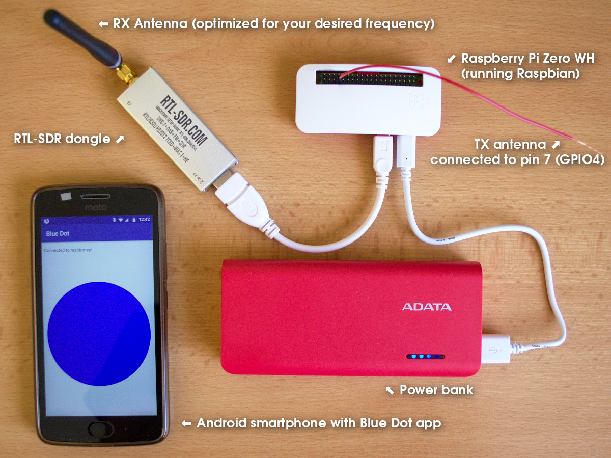

rpi-sdr-replay
==============

**Turns Raspberry Pi into a remotely controlled software Defined Radio (SDR)
transceiver that captures and replays radio signals.**

Use your Android smartphone to control when the radio signal recording should start,
when it should end and then replay it on your discretion. 

Usage
=====

Command line (The server part)
-----------------------------

**Record and replay on 88,3 MHz (FM frequency)**

    $ rpi-sdr-replay -f 88300000

Note: Recordings are stored to a default location ``$HOME/sdr-recordings``

**Record on 88,3 MHz and replay on 88,5 MHz**

    $ /home/pi/git/rpi-sdr-replay/rpi-sdr-replay \
        --rx-frequency 88300000 \
        --tx-frequency 88500000 \
        -d /home/pi/sdr-recordings-fm/

Note: Recordings are stored to a custom directory ``/home/pi/sdr-recordings-fm/`` (the directory must exist!).

**See help (--help/-h) for details**

    $ rpi-sdr-replay --help
    usage: rpi-sdr-replay [-h] [-f FREQUENCY] [-r RX_FREQUENCY] [-t TX_FREQUENCY]
                          [-p] [-d DIR]
    
    Raspberry Pi based bluetooth controlled radio signal replayer
    
    optional arguments:
      -h, --help            show this help message and exit
      -f FREQUENCY, --frequency FREQUENCY
                            Set frequency in Hz for both RX & TX (Default:
                            433050000)
      -r RX_FREQUENCY, --rx-frequency RX_FREQUENCY
                            Set RX frequency in Hz
      -t TX_FREQUENCY, --tx-frequency TX_FREQUENCY
                            Set TX frequency in Hz
      -p, --allow-pairing   Allow bluetooth pairing for the first 60sec after
                            start
      -d DIR, --dir DIR     Directory where to store the recordings

Graphical SmartPhone BlueDot app interface (The client part)
------------------------------------------------------------

The Blue Dot application that was used as Smartphone UI only allow us to have a 
UI with one dot (or square) and control its color and border and that's it.

That said the user interface for rpi-sdr-replay (that uses the Blue Dot) is
based on differently colored dots that define state of the application.
The dot color tells you in what state the app is and defines what actions could
be done.

The dot itself is clickable and rpi-sdr-replay application recognizes several
"zones" that works like "buttons". Here is the schema of the dot zones:

Actions triggered by the individual zones depends on the state of the application
which is described by the color of the dot.
See the next section that describes the individual states (dot colors) and their
clickable zones. Not all states use all zones.
 

### Blue Dot app connect menu

Select your Raspberry Pi device you paired from the list:

### (Blue dot) Main screen

* **Middle** to start recording
* **Left** to go to the latest available recording
* **Bottom** to open "turn off" screen (black dot)

### (Red dot) Recording in progress

* **Press anywhere on the dot** to stop the recording

### (Bright green dot) Latest recording

* **Middle** to replay the recording
* **Left** to go to previous (older) recording
* **Right** to go back to the main screen (blue dot)
* The latest (newest) recording is always this bright green 

### (Dark green dot) Latest-1 recording

* **Middle** to replay the recording
* **Left** to go to previous (older) recording
* **Right** to go to newer recording
* Note: Except of the latest recording that is bright green all other
recordings are dark green and then the older the recording is, its color
get's more lighter ("greyish"). 

### (Greyish dark green dot) Latest-2 recording

* **Middle** to replay the recording
* **Left** to go to previous (older) recording
* **Right** to go to newer recording
* Note: Except of the latest recording that is bright green all other
recordings are dark green and then the older the recording is, its color
get's more lighter ("greyish"). 

### (White dot with border) No more old recordings available

* **Right** to go to newer recording
* If there are no more recordings the dot is white and has a border.

### (No dot shown) Recording is being replayed

* No dot is displayed
* You need to wait till full recording is replayed

### (Black dot) Turn off screen

* **Middle** to confirm the operating system shutdown (Turns off the whole Raspberry Pi!)
* **Left/Right/Bottom/Top** cancel the shutdown and go back to the main screen (blue dot)

Hardware requirements
=====================

* Raspberry Pi with Bluetooth ([that supports rpitx](https://github.com/F5OEO/rpitx#hardware))
  * I use **RaspberryPi Zero WH**
* RTL-SDR dongle
  * There are multiple ones
  * I use [RTL-SDR V3](https://www.rtl-sdr.com)

Setup
=====

**Note:** The setup described in this readme is written for **Raspbian**. Different Linux
distribution may have differently named packages and may require different approach to configuration.

Raspbian system packages
------------------------

    $ sudo apt install \
        build-essential \
        python3-dbus \
        python3-pip \
        git \
        rtl-sdr

Python libraries
----------------

*Note: Before you install python modules by pip, you should consider
use of a python virtual environments. See next section of this readme.*

    $ pip install -r requirements.txt

RTL-SDR setup
-------------

Raspbian system packages got installed in one of previous steps when
**rtl-sdr** package was installed.

Now you need to **blacklist default kernel modules with drivers for RTL-SDR**
chipset that are used for DVB-T decoding.

Depending on the chipset your dongle has, you need to blacklist the correct
kernel module. If you are not sure, you can uncomment all names and blacklist
all of them:

    $ sudo vim /etc/modprobe.d/blacklist-rtl-sdr-dvbt-modules.conf

And add:

    blacklist dvb_usb_rtl28xxu
    blacklist 8192cu
    blacklist rtl8xxxu
    #blacklist rtl2832
    #blacklist rtl2830

Note: Make sure you removed the hash symbol ``#`` from the beggining of the
line that lists the name of kernel module for chipset of your RTL-SDR dongle.
In this example I only blacklist a sub-set of them.

Once done, try to plug in the dongle and run this command to test it:

    $ rtl_test

rpitx setup
-----------

rpitx is a general radio frequency transmitter for Raspberry Pi which doesn't
require any other hardware unless filter to avoid intererence. It can handle
frequencies from 5 KHz up to 1500 MHz.

Project repository: https://github.com/F5OEO/rpitx

Installation instructions:

    $ git clone https://github.com/F5OEO/rpitx
    $ cd rpitx
    $ ./install.sh
    $ sudo reboot

Bluetooth permissions
---------------------

    $ sudo vim /etc/dbus-1/system.d/bluetooth.conf

Add this section (assuming your user is "pi"):

      <policy user="pi">
        <allow own="org.bluez"/>
        <allow send_destination="org.bluez"/>
        <allow send_interface="org.bluez.Agent1"/>
        <allow send_interface="org.bluez.MediaEndpoint1"/>
        <allow send_interface="org.bluez.MediaPlayer1"/>
        <allow send_interface="org.bluez.Profile1"/>
        <allow send_interface="org.bluez.GattCharacteristic1"/>
        <allow send_interface="org.bluez.GattDescriptor1"/>
        <allow send_interface="org.bluez.LEAdvertisement1"/>
        <allow send_interface="org.freedesktop.DBus.ObjectManager"/>
        <allow send_interface="org.freedesktop.DBus.Properties"/>
      </policy>

Restart dbus:

    $ sudo systemctl restart dbus

Raspberry Pi and Android Phone pairing
--------------------------------------

**On Raspberry command line:**

    $ bluetoothctl
    discoverable on
    pairable on
    agent on
    default-agent

Note: You will need to confirm the pairing there in the console once you
attempt to pair with the Raspberry Pi from your phone (see the next section).

**On your Android phone:**

* Enable Bluetooth and search for a new device.
  * The name will be most likely "**raspberrypi**" and its MAC address
    must match the MAC address reported by the bluetoothctl after
    you run ``discoverable on``.
* Pair your phone and the Raspberry Pi device.

Once the devices are paired, quit the bluetoothctl console by pressing
``Ctrl + D``.

Blue Dot Android app
--------------------

Install the [**Blue Dot**](https://play.google.com/store/apps/details?id=com.stuffaboutcode.bluedot)
from Google Play store.

Once you run the app, you should be able to select the correct bluetooth
device (the raspberry you paired in the previous step).

Test Blue Dot setup
-------------------

Run this on your Raspberry:

    $ python3

    from bluedot import BlueDot
    bd = BlueDot()
    bd.wait_for_press()
    print("Button was pressed!")

Then run the Blue Dot app on your smartphone, select the raspberry from the
list of paired devices and after a connection is made, press the blue button!
The code adobe should print out a message "Button was pressed!" once once
the blue button is pressed.

sudo access to /usr/bin/sendiq without password
-----------------------------------------------

The app is using ``/usr/bin/sendiq`` tool, that must be run as root (via ``sudo``).
If you want to use this app, you must make sure the user that is running the server side
has permission to run the ``sendiq`` tool via sudo without asking for password.

There are multiple ways how to achieve that. By default in Raspbian, the default **"pi"** user
usually has ability to use sudo without password for any command.

If you have your own user that by default requires password for sudo, make sure you update
your sudoers configuration to allow the ``/usr/bin/sendiq`` without the password:

    $ sudo visudo

and add a line (where "youruser" is the name of the user you use):

    youruser ALL=(root) NOPASSWD: /usr/bin/sendiq

Note: The better practice would be to create a new sudoers config file in ``/etc/sudoers.d/`` for
this policy with a command like ``sudo visudo -f /etc/sudoers.d/010_sendiq-nopasswd`` instead of
editing ``/etc/sudoers`` directly like I just showed you.
    

Policy kit permissions to Turn Off (Shut Down) the system
---------------------------------------------------------

The app allows you to properly turn off the Raspberry Pi system, but to be
able to do that, the user running the application must have permissions
to do that. To configure that permissions, do the following:

Create and edit a PolicyKit permission:

    $ sudo vim /etc/polkit-1/localauthority/50-local.d/allow_all_users_to_shutdown.pkla

And add there:

    [Allow all users to shutdown]
    Identity=unix-user:*
    Action=org.freedesktop.login1.power-off;org.freedesktop.login1.power-off-multiple-sessions
    ResultActive=yes
    ResultAny=yes

Reload the PolicyKit:

    sudo systemctl daemon-reload

Installation of the rpi-sdr-replay
==================================

Use pip to install the binary and library:

    $ cd rpi-sdr-replay/  # This git repo you cloned with "git clone"
    $ pip3 install .

Virtual env setup
=================

**1)** Install all necessary packages:

    sudo apt-get install virtualenv virtualenvwrapper

**2)** Add the next two lines at the bottom of your ``~/.profile`` file:

    export WORKON_HOME=~/.virtualenvs
    source /usr/share/virtualenvwrapper/virtualenvwrapper.sh

Note: If you have ~/.bash_profile file, then you need to add it there
as in that case the ``~/.profile`` won't be read.

**3)** Create a virtual env

    mkvirtualenv \
        --system-site-packages \
        --python=/usr/bin/python3 \
        rpi-sdr-replay

Note: We are allowing system site python packages to be available in our
virtual env here.

**When you are ready to work** on the new virtual env

    workon rpi-sdr-replay

**Once you are done** deactivate the virtual env

    deactivate

Debugging
=========

Bluetooth
---------

Bluetooth live debugging:

    sudo btmon

Some other tips for bluetooth debugging:
https://fedoraproject.org/wiki/How_to_debug_Bluetooth_problems

RTL-SDR
-------

Test RTL-SDR dongle

    rtl_test

